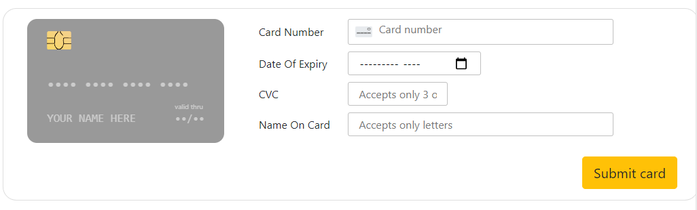
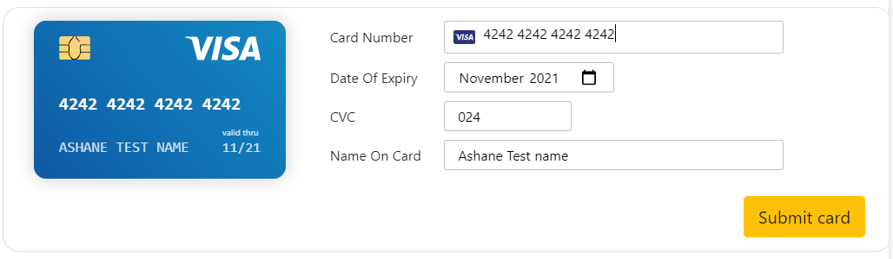
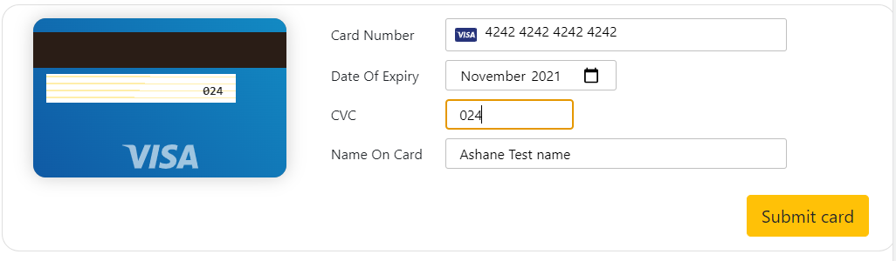

# react easy credit card
This is a test npm package to ease out credit card submission forms

### Installation
Run the following command to install this package.

```bash
npm install react-easy-credit-card
```

To import the library.
```bash
 import ImageCard from "react-easy-credit-card";
```

The library could be used as follows inside a react component
```bash
/*# Write your own function like this when you want to do some processing with the submitted data */
const myhandlefunction = (submittedCardObject) => {

  console.log(submittedCardObject)
  //# prints {cardnumber: 'xxxx xxxx xxxx xxx', expiry: 'mm/yy', cvc: 'xxx', cardname: 'XXXXXX XXXXXXXXXXXXXX'}

  console.log(submittedCardObject.cardnumber)
  //# prints xxxx xxxx xxxx xxx
};

/*## The function which uses the library */
function CreditCardTest() {
  return (
    <div className="image-card-test-page-main">
      <CreditCard 
        submitbuttontext="Submit card" 
        onsubmitfunc={myHandlerFunction} 
        expiryMinMonth="2021-10" />
    </div>
  );
}
 ```
## Want to play with code ?

1. Clone the repository
2. 'npm start' to start on local environment 
3. Open your browser and navigate to 'http://localhost:3000/creditcard'

## Sample Outputs
### 1. The output of v1.0.x before data is entered 



### 2. The output of v1.0.x after data is entered 



### 3. The output of v1.0.x when entering cvv  


 #### Make sure to download the latest release version to experience the advanced features